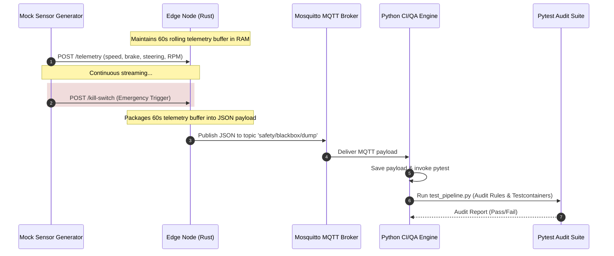

# Closed-Loop Safety & Audit Pipeline for Cyber-Physical Systems

An end-to-end, automated QA infrastructure and safety audit pipeline built for Cyber-Physical Systems (e.g., Autonomous Vehicles). 

When an emergency or crash condition occurs on an Edge hardware node, a **Kill Switch** triggers an immediate dump of the rolling 60-second in-memory telemetry buffer. The dump is published over an **MQTT Broker** to a containerized **Python CI/QA Engine**, which automatically executes safety audit test suites (`pytest`) using `testcontainers`.

---

## 📐 Architecture Overview



---

## 🛠️ Components

### 1. Edge Node (Rust)
* **Location**: `./edge-node`
* **Framework**: `axum`, `tokio`, `serde`, `rumqttc`, `chrono`
* **Logic**:
  * Thread-safe rolling buffer using `Arc<Mutex<VecDeque<TelemetryFrame>>>`.
  * Automatically prunes telemetry entries older than 60 seconds.
  * `POST /telemetry`: Ingests real-time vehicle telemetry frames.
  * `POST /kill-switch` or `POST /trigger-dump`: Packages the 60s telemetry window into a UUID-tagged blackbox JSON payload and publishes to MQTT.

### 2. Message Broker (Eclipse Mosquitto)
* **Location**: `./mosquitto`
* **Container**: `eclipse-mosquitto:2.0`
* **Config**: `./mosquitto/config/mosquitto.conf` allowing local QA MQTT communication on port `1883`.

### 3. CI/QA Engine (Python)
* **Location**: `./ci-engine`
* **Framework**: `paho-mqtt`, `pytest`, `testcontainers`, `pydantic`
* **Logic**:
  * `app.py`: Persistent MQTT client listening to topic `safety/blackbox/dump`.
  * On receipt of a blackbox dump payload, saves the payload and programmatically executes `pytest tests/test_pipeline.py`.
  * `test_pipeline.py`: Pytest suite verifying payload integrity, chronology, brake deceleration, and physical boundaries.

### 4. Chaos Injector & Edge Resilience Test Suite (Python)
* **Location**: `./ci-engine/chaos_injector.py`, `./ci-engine/mock_edge_device.py`, `./ci-engine/tests/test_edge_resilience.py`
* **Description**:
  * `chaos_injector.py`: Utility using `paho-mqtt` to inject environmental hardware fault payloads (`{"sensor": "temperature", "value": 85}`, `{"event": "fatal_error"}`) into the broker.
  * `mock_edge_device.py`: State machine maintaining firmware slot (`A`/`B`) and CPU frequency (`Normal`/`Throttled`).
  * `test_edge_resilience.py`: Automated Pytest suite covering:
    1. **Thermal Throttling Test**: Asserts that sending an 85°C heat spike causes the edge device to switch CPU frequency to `Throttled` and output `{"status": "throttling_active"}` within 3.0 seconds.
    2. **A/B Rollback Test**: Asserts that receiving an OTA update command to Slot B alongside a fatal error payload triggers fallback to Slot A (`{"fallback_to_slot_a": true}`).

### 5. Mock Telemetry Generator (Python)
* **Location**: `./edge-node/mock_telemetry_generator.py`
* **Description**: CLI utility simulating dynamic vehicle dynamics (fluctuating speed, brake taps, steering oscillations) and streaming sensor data to the Edge Node REST endpoint with options to trigger the Kill Switch.

---

## 🧪 Running Chaos & Resilience Pytest Suites

To execute the chaos engineering tests locally or within container:

```bash
pytest -v ci-engine/tests/test_edge_resilience.py
```

Expected output:
```text
PASSED ci-engine/tests/test_edge_resilience.py::test_thermal_throttling
PASSED ci-engine/tests/test_edge_resilience.py::test_ab_rollback_on_failed_ota
```

---

## 📋 JSON Blackbox Payload Schema

Below is the JSON structure published over MQTT topic `safety/blackbox/dump`:

```json
{
  "event_id": "9b1deb4d-3b7d-4bad-9bdd-2b0d7b3dcb6d",
  "timestamp": "2026-08-05T12:00:00Z",
  "trigger_reason": "KILL_SWITCH_MANUAL_TRIGGER",
  "buffer_duration_seconds": 60,
  "frame_count": 300,
  "telemetry": [
    {
      "timestamp": "2026-08-05T11:59:00.123Z",
      "speed_kmh": 65.4,
      "brake_status": true,
      "brake_pressure_psi": 220.5,
      "steering_angle_deg": -2.1,
      "wheel_speed_rpm": 578.3
    }
  ]
}
```

---

## 🚀 Quickstart & Deployment

### 1. Spin up the Architecture via Docker Compose

```bash
docker-compose up --build
```

This will launch:
* `mosquitto_broker` on `1883`
* `rust_edge_node` on `http://localhost:8080`
* `python_ci_engine` listening for MQTT messages

---

### 2. Stream Mock Telemetry & Trigger Kill Switch

In a separate terminal, launch the mock data generator:

```bash
python edge-node/mock_telemetry_generator.py --url http://localhost:8080 --rate 5 --trigger-kill 10
```

* Flags:
  * `--url`: Edge Node endpoint (default: `http://localhost:8080`).
  * `--rate`: Telemetry frequency in Hz (default: `5`).
  * `--trigger-kill`: Automatically trigger Kill Switch after 10 seconds of streaming.

---

### 3. Observe Automated QA Audit Trigger

Inspect the `python_ci_engine` logs to observe blackbox payload ingestion and automated pytest execution:

```bash
docker logs -f python_ci_engine
```

---

## 📂 Project Repository

Git Remote: `https://github.com/EricXPalace/Woven-qainfra-considering.git`
