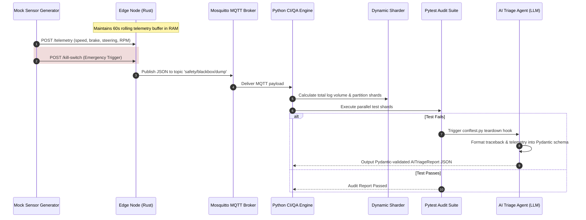

# Closed-Loop Safety & Audit Pipeline for Cyber-Physical Systems

An end-to-end, automated QA infrastructure and safety audit pipeline built for Cyber-Physical Systems (e.g., Autonomous Vehicles). 

When an emergency or crash condition occurs on an Edge hardware node, a **Kill Switch** triggers an immediate dump of the rolling 60-second in-memory telemetry buffer. The dump is published over an **MQTT Broker** to a containerized **Python CI/QA Engine**, which automatically executes safety audit test suites (`pytest`) using `testcontainers`.

---

## 📐 Architecture Overview



---

## 🛠️ Components

### 1. Edge Node (Rust)
* **Location**: `./edge-node`
* **Framework**: `axum`, `tokio`, `serde`, `rumqttc`, `chrono`
* **Logic**:
  * Thread-safe rolling buffer using `Arc<Mutex<VecDeque<TelemetryFrame>>>`.
  * Automatically prunes telemetry entries older than 60 seconds.
  * `POST /telemetry`: Ingests real-time vehicle telemetry frames.
  * `POST /kill-switch` or `POST /trigger-dump`: Packages the 60s telemetry window into a UUID-tagged blackbox JSON payload and publishes to MQTT.

### 2. Message Broker (Eclipse Mosquitto)
* **Location**: `./mosquitto`
* **Container**: `eclipse-mosquitto:2.0`
* **Config**: `./mosquitto/config/mosquitto.conf` allowing local QA MQTT communication on port `1883`.

### 3. CI/QA Engine & Dynamic Sharding (Python)
* **Location**: `./ci-engine/dynamic_sharder.py`, `./ci-engine/app.py`
* **Framework**: `paho-mqtt`, `pytest`, `testcontainers`, `pydantic`
* **Logic**:
  * `dynamic_sharder.py`: Scans incoming telemetry crash logs, calculates cumulative data volume (MB), and dynamically partitions files into balanced test shards (`shard_config.json`).
  * `app.py`: Persistent MQTT client listening to topic `safety/blackbox/dump`. On payload receipt, triggers automated `pytest` suites.

### 4. Chaos Injector & Edge Resilience Test Suite (Python)
* **Location**: `./ci-engine/chaos_injector.py`, `./ci-engine/mock_edge_device.py`, `./ci-engine/tests/test_edge_resilience.py`
* **Description**:
  * `chaos_injector.py`: Utility using `paho-mqtt` to inject environmental hardware fault payloads (`{"sensor": "temperature", "value": 85}`, `{"event": "fatal_error"}`) into the broker.
  * `mock_edge_device.py`: State machine maintaining firmware slot (`A`/`B`) and CPU frequency (`Normal`/`Throttled`).
  * `test_edge_resilience.py`: Automated Pytest suite covering Thermal Throttling and A/B Rollback tests.

### 5. AI-Driven Root Cause Analysis (RCA) Agent (Python)
* **Location**: `./ci-engine/ai_triage_agent.py`, `./ci-engine/conftest.py`
* **Description**:
  * `ai_triage_agent.py`: Production-grade LLM triage agent strictly validated with `Pydantic` v2 (`AITriageReport` schema with failure category, confidence score, root cause analysis, and suggested fix). Mocks local LLM (Ollama/Gemma) requests while enforcing structural typing.
  * `conftest.py`: Pytest teardown hook (`pytest_runtest_makereport`) that intercepts test failures, extracts tracebacks & telemetry context, and automatically invokes `AITriageAgent` to generate JSON report artifacts (`triage_report_<test_name>.json`).

### 6. Mock Telemetry Generator (Python)
* **Location**: `./edge-node/mock_telemetry_generator.py`
* **Description**: CLI utility simulating dynamic vehicle dynamics and streaming sensor data to the Edge Node REST endpoint.

---

## ⚡ Running Dynamic Test Sharding & AI Triage

### 1. Execute Dynamic Sharding Orchestration

```bash
python ci-engine/dynamic_sharder.py --dir /path/to/crash_logs --target-mb 10.0 --out shard_config.json
```

### 2. Pytest Failure Hook with AI Triage Execution

When a Pytest fails, `conftest.py` automatically intercepts the failure and outputs a Pydantic-validated RCA report:

```json
{
  "failure_category": "Thermal Throttling Timeout",
  "confidence_score": 0.95,
  "summary": "Mock device CPU frequency failed to throttle within 3.0s threshold following heat spike.",
  "root_cause_analysis": "The mock hardware agent received an 85°C thermal fault, but the event loop delayed publishing the status message to MQTT.",
  "suggested_fix": "Inspect thermal monitoring thread scheduling and ensure MQTT publish callbacks are non-blocking.",
  "telemetry_anomaly_timestamp": "2026-08-05T20:00:00Z"
}
```

---

## 📋 JSON Blackbox Payload Schema

Below is the JSON structure published over MQTT topic `safety/blackbox/dump`:

```json
{
  "event_id": "9b1deb4d-3b7d-4bad-9bdd-2b0d7b3dcb6d",
  "timestamp": "2026-08-05T12:00:00Z",
  "trigger_reason": "KILL_SWITCH_MANUAL_TRIGGER",
  "buffer_duration_seconds": 60,
  "frame_count": 300,
  "telemetry": [
    {
      "timestamp": "2026-08-05T11:59:00.123Z",
      "speed_kmh": 65.4,
      "brake_status": true,
      "brake_pressure_psi": 220.5,
      "steering_angle_deg": -2.1,
      "wheel_speed_rpm": 578.3
    }
  ]
}
```

---

## 🚀 Quickstart & Deployment

### 1. Spin up the Architecture via Docker Compose

```bash
docker-compose up --build
```

---

## 📂 Project Repository

Git Remote: `https://github.com/EricXPalace/Woven-qainfra-considering.git`
